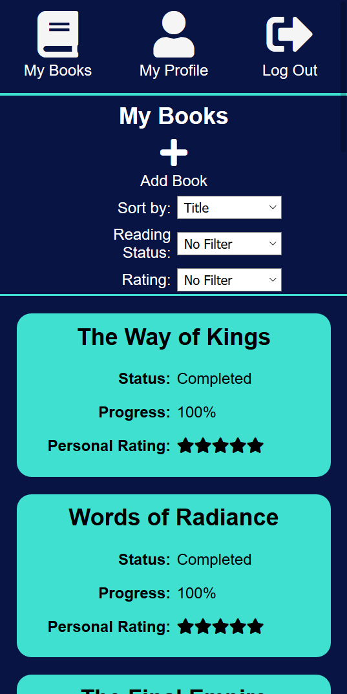
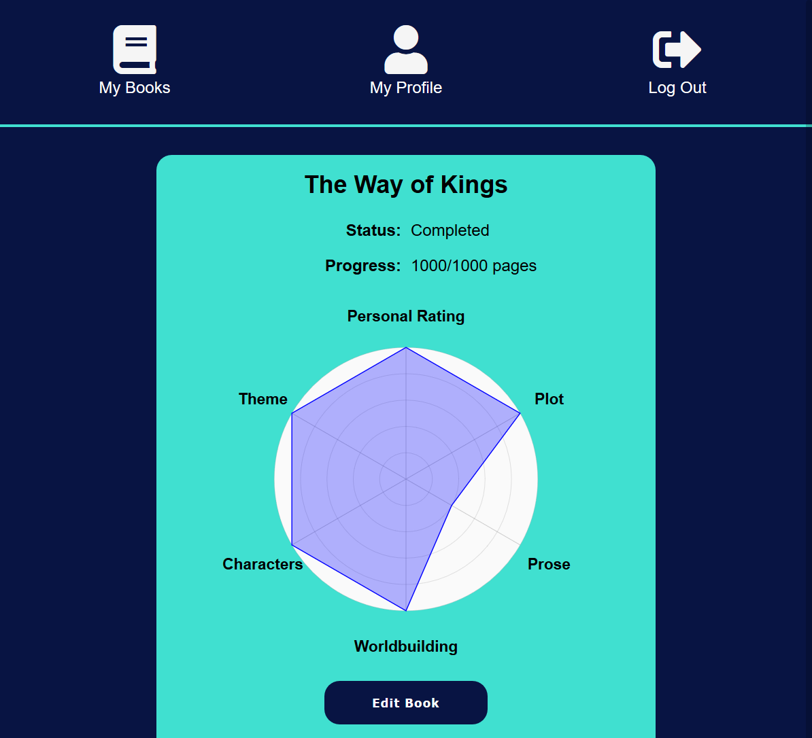

# BookTracker

## Link: https://booktracker-app.now.sh

## Welcome to BookTracker
BookTracker is an app that will allow you to track what books you're reading, your progress in you
books, and rate the books you've read in a more granular fashion than other reading apps. 

BookTracker also provides users with a profile of their reading habits and proclivities, based on their 
ratings of books in their library. 

## Features (for all users)
 :white_check_mark: Keep track of all of the books you've started, finished, or DNF'd (did not finish)

 :white_check_mark: Track progress, rate books based on a granular set of features rather than a single star rating, and save your reviews

 :white_check_mark: Check your user profile for a snapshot of your readinga nd rating habits, based on your library

## BookTracker In Action

### Mobile List View

### Mobile Book View

### Mobile Profile View

## Tech Specs: 
**Front-end:**
- React
- HTML5
- CSS
- Zeit

**Back-end**
- Node
- Express
- PostgreSQL DB hosted on Heroku
- JWT 
